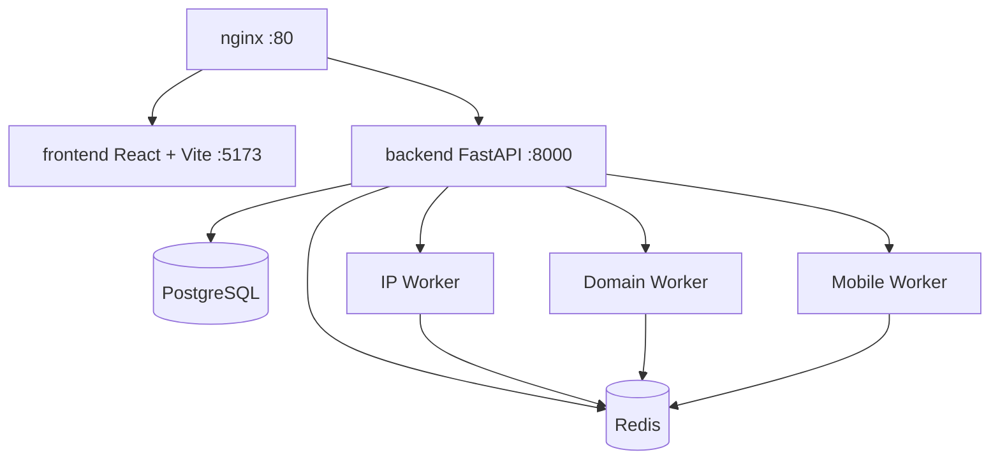

# VulnScanner

[](https://github.com/gmedia/vuln-scanner)

Web-based vulnerability scanner with 3 scan modes — IP, domain, and APK/IPA mobile analysis. Deployed via Docker Compose with async task processing.

## Architecture



## Quick Start

```bash
# 1. Clone & configure
cp .env.example .env
# Edit .env — set API_KEY to a secret value

# 2. Start all services
docker compose up -d

# 3. Open dashboard
# http://localhost
```

## Local Development

Prerequisites: Node.js 20+, Python 3.12+, Docker (PostgreSQL & Redis).

### Quick Start (Makefile)

```bash
make install-dev  # Install dependencies + pre-commit hooks
make dev          # Start PostgreSQL + Redis
```

### 1. Infrastructure (PostgreSQL + Redis)

```bash
docker run -d --name vscan-pg -e POSTGRES_USER=vscan -e POSTGRES_PASSWORD=vscan -e POSTGRES_DB=vscan -p 5432:5432 postgres:16
docker run -d --name vscan-redis -p 6379:6379 redis:8
```

### 2. Backend

```bash
cd backend
python -m venv .venv && source .venv/bin/activate
pip install -r requirements.txt

# Run migrations
alembic upgrade head

# Start dev server (hot-reload)
uvicorn app.main:app --reload --port 8000
```

### 3. Workers

Open separate terminals — one per queue:

```bash
cd workers
python -m venv .venv && source .venv/bin/activate
pip install -r requirements.txt

# Terminal 1 — IP scans
celery -A celery_app worker -Q ip_scan --loglevel=info

# Terminal 2 — Domain scans
celery -A celery_app worker -Q domain_scan --loglevel=info

# Terminal 3 — Mobile scans
celery -A celery_app worker -Q mobile_scan --loglevel=info
```

### 4. Frontend

```bash
cd frontend
npm install
npm run dev  # → http://localhost:5173
```

### Project Structure

```
vuln-scanner/
├── backend/             # FastAPI app
│   ├── app/
│   │   ├── api/         # Routes, WebSocket, router
│   │   ├── models/      # SQLAlchemy models
│   │   ├── schemas/     # Pydantic schemas
│   │   └── services/    # Business logic
│   └── alembic/         # DB migrations
├── workers/             # Celery workers
│   ├── tasks/           # ip_scan, domain_scan, mobile_scan
│   └── utils/           # nmap, CVE lookup, domain/mobile utils
├── frontend/            # React + Vite
│   └── src/
│       ├── api/         # API client
│       ├── components/  # UI components
│       ├── hooks/       # WebSocket hooks
│       ├── pages/       # Page views
│       └── store/       # State management
├── nginx/               # Reverse proxy config
├── docker-compose.yml   # Production stack
└── .env.example         # Environment template
```

## Scan Modes

| Mode | Input | What It Does |
|------|-------|-------------|
| **IP Scanner** | IP address | Port scan via nmap (`-sV -sC -O`), CVE lookup via OSV.dev, severity classification |
| **Domain Scanner** | Domain name | DNS resolution, subdomain enum (crt.sh), SSL/TLS analysis, security headers audit, tech stack fingerprinting |
| **Mobile Scanner** | APK/IPA file | Manifest analysis, permission classification, exported component detection, hardcoded secret scanning |

## API

### Authentication

VulnScanner supports two auth methods:

| Method | Header | Use Case |
|--------|--------|----------|
| **JWT Bearer** | `Authorization: Bearer <token>` | Dashboard users (web UI) |
| **API Key** | `X-API-Key: <key>` | Programmatic / machine-to-machine |

**JWT auth** is the primary auth for the dashboard. Obtain tokens via the auth endpoints:

```bash
# Register a new account
curl -X POST http://localhost/api/auth/register \
  -H "Content-Type: application/json" \
  -d '{"email":"user@example.com","password":"str0ng!Pa55","confirm_password":"str0ng!Pa55"}'

# Login — returns access + refresh tokens
curl -X POST http://localhost/api/auth/login \
  -H "Content-Type: application/json" \
  -d '{"email":"user@example.com","password":"str0ng!Pa55"}'

# Use access token for authenticated requests
curl http://localhost/api/scan/history \
  -H "Authorization: Bearer <access-token>"
```

**API Key auth** bypasses user auth for service-to-service calls:

```bash
# Start scan (API key)
curl -X POST http://localhost/api/scan/ip \
  -H "X-API-Key: your-key" \
  -H "Content-Type: application/json" \
  -d '{"target": "8.8.8.8", "ports": "22-443"}'

# Get results
curl http://localhost/api/scan/{id} \
  -H "X-API-Key: your-key"

# Export HTML report
curl http://localhost/api/scan/{id}/export?format=html \
  -H "X-API-Key: your-key" -o report.html
```

### Key Endpoints

| Endpoint | Auth | Method | Description |
|----------|------|--------|-------------|
| `/api/auth/register` | None | `POST` | Create account |
| `/api/auth/login` | None | `POST` | Login, get tokens |
| `/api/auth/refresh` | JWT | `POST` | Refresh access token |
| `/api/auth/me` | JWT | `GET` | Get current user |
| `/api/scan/ip` | JWT/Key | `POST` | Start IP scan |
| `/api/scan/domain` | JWT/Key | `POST` | Start domain scan |
| `/api/scan/mobile` | JWT/Key | `POST` | Upload APK/IPA for scan |
| `/api/scan/history` | JWT | `GET` | Paginated scan history |
| `/api/scan/{id}` | JWT | `GET` | Scan detail + findings |
| `/api/scan/{id}/findings` | JWT | `GET` | Findings only |
| `/api/scan/{id}/export` | JWT | `GET` | Export as JSON or HTML |
| `/api/credits/balance` | JWT | `GET` | Credit balance |
| `/api/credits/eligibility/{type}` | JWT | `GET` | Check scan cost |
| `/api/admin/stats` | JWT+Admin | `GET` | Admin dashboard stats |
| `/api/admin/users` | JWT+Admin | `GET` | List/manage users |
| `/api/admin/pricing` | JWT+Admin | `GET/PUT` | Manage pricing |
| `/ws/scan/{job_id}` | JWT | WebSocket | Real-time scan progress |
| `/health` | None | `GET` | Health check |
| `/metrics` | None | `GET` | Prometheus metrics |

## Environment Variables

| Variable | Default | Description |
|----------|---------|-------------|
| `API_KEY` | `dev-api-key-change-me` | API key for machine-to-machine auth |
| `SECRET_KEY` | — | Secret for token signing |
| `JWT_SECRET` | — | JSON Web Token signing key |
| `JWT_ALGORITHM` | `HS256` | JWT signing algorithm |
| `JWT_ACCESS_EXPIRE_MINUTES` | `30` | Access token TTL |
| `JWT_REFRESH_EXPIRE_DAYS` | `7` | Refresh token TTL |
| `DATABASE_URL` | `postgresql+asyncpg://...` | PostgreSQL connection string |
| `REDIS_URL` | `redis://:${REDIS_PASSWORD}@redis:6379/0` | Redis connection string |

## Services

| Service | Port | Description |
|---------|------|-------------|
| nginx | `:80` | Reverse proxy |
| frontend | `:5173` | React dashboard |
| backend | `:8000` | FastAPI REST API |
| ip_worker | — | IP scan tasks |
| domain_worker | — | Domain scan tasks |
| mobile_worker | — | Mobile scan tasks |
| postgres | `:5432` | Database |
| redis | `:6379` | Message broker / cache |

## Tech Stack

- **Frontend**: TypeScript, React, Vite, TailwindCSS, shadcn/ui
- **Backend**: Python, FastAPI, SQLAlchemy, Alembic
- **Workers**: Celery, Redis
- **CVE Source**: OSV.dev (free, no API key)
- **Deployment**: Docker Compose

## License

MIT
