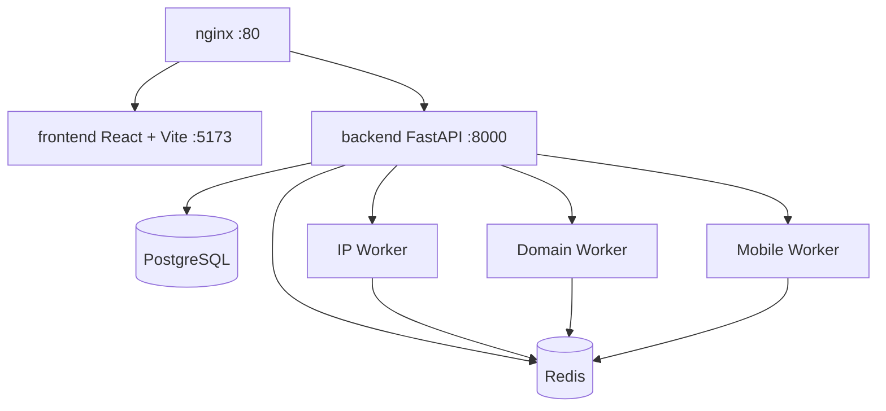

# VulnScanner

[](https://github.com/gmedia/vuln-scanner)

Web-based vulnerability scanner with 3 scan modes — IP, domain, and mobile (Android APK/AAB / iOS IPA) analysis. Deployed via Docker Compose with async task processing.

## Architecture


```mermaid
graph TD
    nginx[nginx :80] --> frontend[frontend React + Vite :5173]
    nginx --> backend[backend FastAPI :8000]
    backend --> postgres[(PostgreSQL)]
    backend --> redis[(Redis)]
    backend --> ip_worker[IP Worker]
    backend --> domain_worker[Domain Worker]
    backend --> mobile_worker[Mobile Worker]
    ip_worker --> redis
    domain_worker --> redis
    mobile_worker --> redis
```

## Quick Start

```bash
# 1. Clone & configure
cp .env.example .env
# Edit .env — set API_KEY to a secret value

# 2. Start all services
docker compose up -d

# 3. Open dashboard
# http://localhost
```

## Local Development

Prerequisites: Node.js 24+, Python 3.12+, Docker (PostgreSQL & Redis).

### Quick Start (Makefile)

```bash
make install-dev  # Install dependencies + pre-commit hooks
make dev          # Start PostgreSQL + Redis
```

### 1. Infrastructure (PostgreSQL + Redis)

```bash
docker run -d --name vscan-pg -e POSTGRES_USER=vscan -e POSTGRES_PASSWORD=vscan -e POSTGRES_DB=vscan -p 5432:5432 postgres:16
docker run -d --name vscan-redis -p 6379:6379 redis:8
```

### 2. Backend

```bash
cd backend
python -m venv .venv && source .venv/bin/activate
pip install -r requirements.txt

# Run migrations
alembic upgrade head

# Start dev server (hot-reload)
uvicorn app.main:app --reload --port 8000
```

### 3. Workers

Open separate terminals — one per queue:

```bash
cd workers
python -m venv .venv && source .venv/bin/activate
pip install -r requirements.txt

# Terminal 1 — IP scans
celery -A celery_app worker -Q ip_scan --loglevel=info

# Terminal 2 — Domain scans
celery -A celery_app worker -Q domain_scan --loglevel=info

# Terminal 3 — Mobile scans
celery -A celery_app worker -Q mobile_scan --loglevel=info
```

### 4. Frontend

```bash
cd frontend
npm install
npm run dev  # → http://localhost:5173
```

### Project Structure

```
vuln-scanner/
├── backend/             # FastAPI app
│   ├── app/
│   │   ├── api/         # Routes, WebSocket, router
│   │   ├── models/      # SQLAlchemy models
│   │   ├── schemas/     # Pydantic schemas
│   │   └── services/    # Business logic
│   └── alembic/         # DB migrations
├── workers/             # Celery workers
│   ├── tasks/           # ip_scan, domain_scan, mobile_scan
│   └── utils/           # nmap, CVE lookup, domain/mobile utils
├── frontend/            # React + Vite
│   └── src/
│       ├── api/         # API client
│       ├── components/  # UI components
│       ├── hooks/       # WebSocket hooks
│       ├── pages/       # Page views
│       └── store/       # State management
├── nginx/               # Reverse proxy config
├── docker-compose.yml   # Production stack
└── .env.example         # Environment template
```

## Scan Modes

| Mode | Input | What It Does |
|------|-------|-------------|
| **IP Scanner** | IP address | Port scan via nmap (`-sV -sC -O`), CVE lookup via OSV.dev, severity classification |
| **Domain Scanner** | Domain name | DNS resolution, subdomain enum (crt.sh), SSL/TLS analysis, security headers audit, tech stack fingerprinting |
| **Mobile Scanner** | Android `.apk`/`.aab` or iOS `.ipa` | Manifest analysis, permission classification, exported component detection, hardcoded secret scanning |

## API

### Authentication

VulnScanner supports two auth methods:

| Method | Header | Use Case |
|--------|--------|----------|
| **JWT Bearer** | `Authorization: Bearer <token>` | Dashboard users (web UI) |
| **API Key** | `X-API-Key: <key>` | Programmatic / machine-to-machine |

**JWT auth** is the primary auth for the dashboard. Obtain tokens via the auth endpoints:

```bash
# Register a new account
curl -X POST http://localhost/api/auth/register \
  -H "Content-Type: application/json" \
  -d '{"email":"user@example.com","password":"str0ng!Pa55","confirm_password":"str0ng!Pa55"}'

# Login — returns access + refresh tokens
curl -X POST http://localhost/api/auth/login \
  -H "Content-Type: application/json" \
  -d '{"email":"user@example.com","password":"str0ng!Pa55"}'

# Use access token for authenticated requests
curl http://localhost/api/scan/history \
  -H "Authorization: Bearer <access-token>"
```

**API Key auth** bypasses user auth for service-to-service calls:

```bash
# Start scan (API key)
curl -X POST http://localhost/api/scan/ip \
  -H "X-API-Key: your-key" \
  -H "Content-Type: application/json" \
  -d '{"target": "8.8.8.8", "ports": "22-443"}'

# Get results
curl http://localhost/api/scan/{id} \
  -H "X-API-Key: your-key"

# Export HTML report
curl http://localhost/api/scan/{id}/export?format=html \
  -H "X-API-Key: your-key" -o report.html
```

### Key Endpoints

| Endpoint | Auth | Method | Description |
|----------|------|--------|-------------|
| `/api/auth/register` | None | `POST` | Create account |
| `/api/auth/login` | None | `POST` | Login, get tokens |
| `/api/auth/refresh` | JWT | `POST` | Refresh access token |
| `/api/auth/me` | JWT | `GET` | Get current user |
| `/api/scan/ip` | JWT/Key | `POST` | Start IP scan |
| `/api/scan/domain` | JWT/Key | `POST` | Start domain scan |
| `/api/scan/mobile` | JWT/Key | `POST` | Upload Android APK/AAB or iOS IPA for scan |
| `/api/scan/history` | JWT | `GET` | Paginated scan history |
| `/api/scan/{id}` | JWT | `GET` | Scan detail + findings |
| `/api/scan/{id}/findings` | JWT | `GET` | Findings only |
| `/api/scan/{id}/export` | JWT | `GET` | Export as JSON or HTML |
| `/api/credits/balance` | JWT | `GET` | Credit balance |
| `/api/credits/eligibility/{type}` | JWT | `GET` | Check scan cost |
| `/api/admin/stats` | JWT+Admin | `GET` | Admin dashboard stats |
| `/api/admin/users` | JWT+Admin | `GET` | List/manage users |
| `/api/admin/pricing` | JWT+Admin | `GET/PUT` | Manage pricing |
| `/ws/scan/{job_id}` | JWT | WebSocket | Real-time scan progress |
| `/health` | None | `GET` | DB + Redis health (`200` ok / `503` degraded) |
| `/health/queues` | None | `GET` | Celery queue depths + `auto_failed` counters |
| `/metrics` | API Key | `GET` | Prometheus metrics (requires `X-API-Key`) |

### Dependency pins & residual risks

- Broker stack (Redis 8 server vs `redis-py` 6.4 / Celery): [`docs/dependency-pins.md`](docs/dependency-pins.md)
- Accepted npm residual (React Router RSC GHSA): [`SECURITY.md`](SECURITY.md#accepted-residual-dependency-risks)
- Quick broker smoke: `./scripts/smoke-broker.sh` (optional path arg on deploy host)

### Observability

| Signal | Source | Notes |
|--------|--------|-------|
| Queue depth | `GET /health/queues` → `queues.{ip_scan,domain_scan,mobile_scan,dead_letter}` | Public, for uptime monitors |
| Auto-failed jobs | `GET /health/queues` → `auto_failed.{pending,running}` | Cumulative Redis counters (7d TTL) |
| Prometheus gauge | `vuln_maintenance_auto_failed_jobs{status=pending\|running}` on `/metrics` | Scrape with API key |
| Auto-fail alert | Worker `logger.error` + optional Sentry | Fires when count ≥ `AUTO_FAIL_ALERT_THRESHOLD` (default `1`) |

#### Prometheus scrape & alert (optional)

No in-repo Grafana/Prometheus stack — point an existing Prometheus at the public edge:

```bash
# Verify scrape surface (401 without key, 200 with key)
curl -sS -o /dev/null -w "%{http_code}\n" https://vs.appmedia.id/metrics
curl -sS -H "X-API-Key: $API_KEY" https://vs.appmedia.id/metrics | grep vuln_maintenance
```

- Scrape job template: [`monitoring/prometheus-scrape.example.yml`](monitoring/prometheus-scrape.example.yml)
- Alert rule template: [`monitoring/alerts-vuln-scanner.example.yml`](monitoring/alerts-vuln-scanner.example.yml)
  Fires when `sum(vuln_maintenance_auto_failed_jobs) > 0` for 5m.

`/metrics` requires `X-API-Key`. Prefer a local metrics proxy/sidecar that injects the header rather than putting the key in a public scrape config.

#### Host nginx (production)

Production uses **host nginx** (not the compose nginx service). Config:

- Template: [`nginx/vs.appmedia.id.conf`](nginx/vs.appmedia.id.conf) → `/etc/nginx/conf.d/vs.appmedia.id.conf`
- Frontend upstream: `127.0.0.1:5174` (compose publishes frontend on host `5174`)
- Backend upstream: `127.0.0.1:8000`
- Public routes: `/health`, `/health/queues`
- API-key route: `/metrics` (auth enforced by FastAPI)

```bash
sudo cp nginx/vs.appmedia.id.conf /etc/nginx/conf.d/vs.appmedia.id.conf
sudo nginx -t && sudo systemctl reload nginx
```

### Production deploys

| Change type | Script | Notes |
|-------------|--------|-------|
| **SPA / frontend only** | [`scripts/deploy-frontend.sh`](scripts/deploy-frontend.sh) | Rebuild + recreate `frontend` only. Prefer for UI waves. |
| **App services (safe)** | [`scripts/deploy-services.sh`](scripts/deploy-services.sh) | Rebuild + recreate selected app services (`--no-deps`). **Never** touches postgres/redis volumes. Default: all app services; or pass e.g. `backend frontend worker_mobile`. Runs Alembic when `backend` is included. |
| **Full stack** | [`scripts/deploy.sh`](scripts/deploy.sh) | Rebuild all images, restart services, run Alembic. **Destructive history** (`down --volumes`). Prefer `deploy-services.sh` for routine app deploys. |

```bash
# On the deploy host after git pull of the target SHA
# (pass the local checkout path as the first argument if required by the script):

# SPA-only:
./scripts/deploy-frontend.sh /path/to/vuln-scanner

# Backend + mobile worker + SPA (typical multi-service wave):
./scripts/deploy-services.sh /path/to/vuln-scanner backend frontend worker_mobile

# All app services (still leaves postgres/redis volumes intact):
./scripts/deploy-services.sh /path/to/vuln-scanner

# Verify SPA hash flipped + API still healthy (use your public base URL):
curl -sS "$PUBLIC_BASE_URL/api/health"
curl -sS "$PUBLIC_BASE_URL/" | grep -oE 'assets/index-[^"]+\.js'
```

### E2E user (prod visual QA / Playwright)

Credentials are **not** documented in this public repo. Configure via environment (see `scripts/ensure_e2e_user.sh` and `frontend/e2e/global-setup.ts`): typically `E2E_EMAIL` / `E2E_PASSWORD` (and matching app secrets on the deploy host).

Expected **flags** after ensure script (not secrets): `is_admin=true`, `is_verified=true`, credits ≥ 100.

If login returns 401/403/429, reset on the deploy host:

```bash
./scripts/ensure_e2e_user.sh
# optional smoke (substitute env — do not commit real values):
curl -sS -X POST "$PUBLIC_BASE_URL/api/auth/login" \
  -H 'Content-Type: application/json' \
  -d "{\"email\":\"$E2E_EMAIL\",\"password\":\"$E2E_PASSWORD\"}"
```

Do **not** `POST /api/auth/register` for the shared e2e mailbox on prod — it can create an unverified user and break Playwright.

Wave E full-site screenshots (18 routes, 1440×900):

```bash
cd frontend && npm ci   # needs @playwright/test
cd ..
node scripts/wave-e-screenshots.mjs
# PNGs + report → .playwright-mcp/screenshots-wave-e/
```

## Environment Variables

| Variable | Default | Description |
|----------|---------|-------------|
| `API_KEY` | `dev-api-key-change-me` | API key for machine-to-machine auth |
| `SECRET_KEY` | — | Secret for token signing |
| `JWT_SECRET` | — | JSON Web Token signing key |
| `JWT_ALGORITHM` | `HS256` | JWT signing algorithm |
| `JWT_ACCESS_EXPIRE_MINUTES` | `30` | Access token TTL |
| `JWT_REFRESH_EXPIRE_DAYS` | `7` | Refresh token TTL |
| `DATABASE_URL` | `postgresql+asyncpg://...` | PostgreSQL connection string |
| `REDIS_URL` | `redis://:${REDIS_PASSWORD}@redis:6379/0` | Redis connection string |
| `SENTRY_DSN` | (empty) | Optional Sentry error tracking |
| `AUTO_FAIL_ALERT_THRESHOLD` | `1` | Min auto-failed jobs per run to alert |

## Services

| Service | Port | Description |
|---------|------|-------------|
| nginx (compose) | `:80` | Reverse proxy (local/dev compose only) |
| host nginx | `:443` | Prod edge SSL (`vs.appmedia.id`) |
| frontend | `:5173` local / `:5174` prod host | React dashboard |
| backend | `:8000` | FastAPI REST API |
| ip_worker | — | IP scan tasks |
| domain_worker | — | Domain scan tasks |
| mobile_worker | — | Mobile scan tasks |
| dead_letter_worker | — | Dead-letter queue consumer |
| celery_beat | — | Periodic maintenance (stale job auto-fail) |
| postgres | `:5432` | Database |
| redis | `:6379` | Message broker / cache |

## Tech Stack

- **Frontend**: TypeScript, React, Vite, TailwindCSS, shadcn/ui
- **Backend**: Python, FastAPI, SQLAlchemy, Alembic
- **Workers**: Celery, Redis
- **CVE Source**: OSV.dev (free, no API key)
- **Deployment**: Docker Compose

## License

MIT
